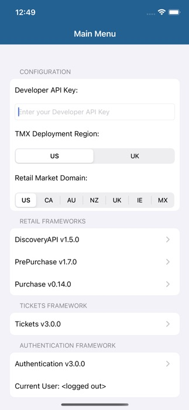
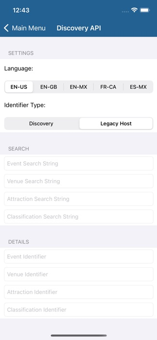
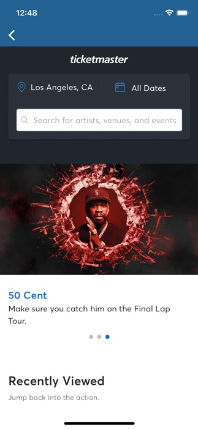
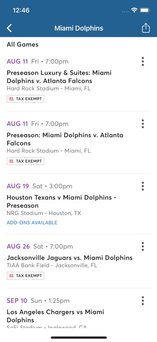
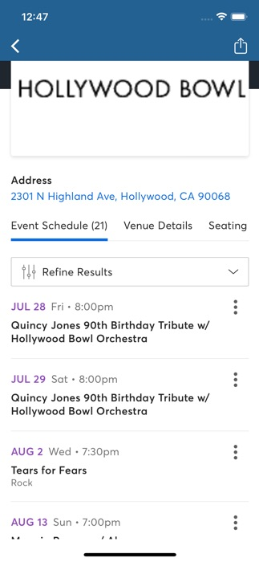
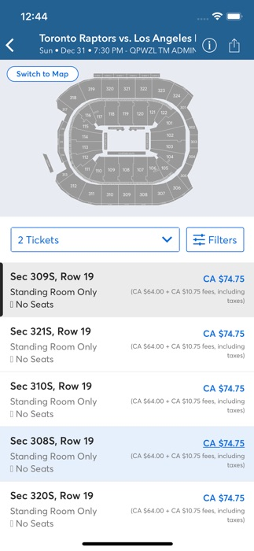
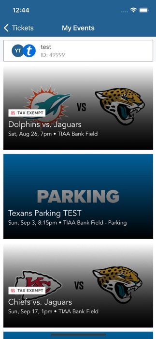
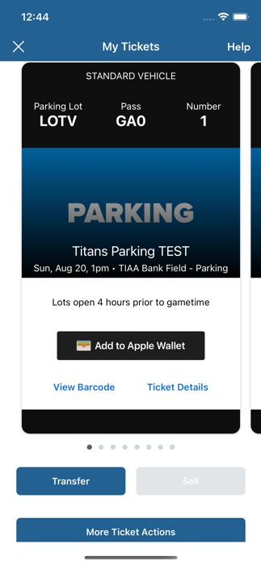
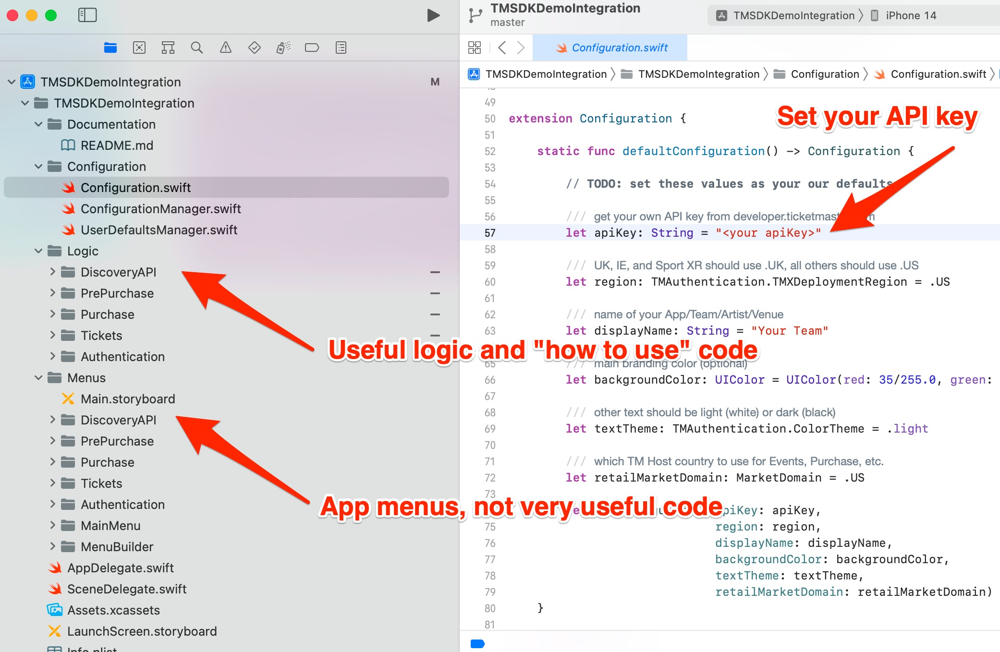

# iOS Ticketmaster SDK Application Integration Demo

This is an example integration of the Ticketmaster Ignite SDK, Retail, Tickets, and Authentication frameworks.

* Overview: https://business.ticketmaster.com/ignite/
* Release Notes: 
  * Retail: https://ignite.ticketmaster.com/docs/ios-retail-change-log
  * Authentication: https://ignite.ticketmaster.com/docs/ios-authentication-change-log
  * Tickets: https://ignite.ticketmaster.com/docs/ios-tickets-change-log
* Documentation: https://ignite.ticketmaster.com/
* Frameworks: https://github.com/ticketmaster/iOS-TicketmasterSDK

### Change Log

* Tickets SDK: https://ignite.ticketmaster.com/docs/ios-tickets-change-log
* Retail SDK: https://ignite.ticketmaster.com/docs/ios-retail-change-log
* Authentication SDK: https://ignite.ticketmaster.com/docs/ios-authentication-change-log

## Demo App Screenshots

  
  
 
  

## Getting Started

1. Open **TMSDKDemoIntegration.xcodeproj** using Swift 5.9+ (Xcode 15.0.1+ or Xcode 16.0+)
   1. This will also download the required .xcframeworks using Swift Package Manager
2. Update **Configuration.swift** with your own API key, available from [https://developer.ticketmaster.com/explore/](https://developer.ticketmaster.com/explore/)
3. Update **TMSDKDemoIntegration** target's _Signing & Capabilities_ with your own Apple Developer certificate from [https://developer.apple.com/](https://developer.apple.com/)
4. Build and Run **TMSDKDemoIntegration** target

 
